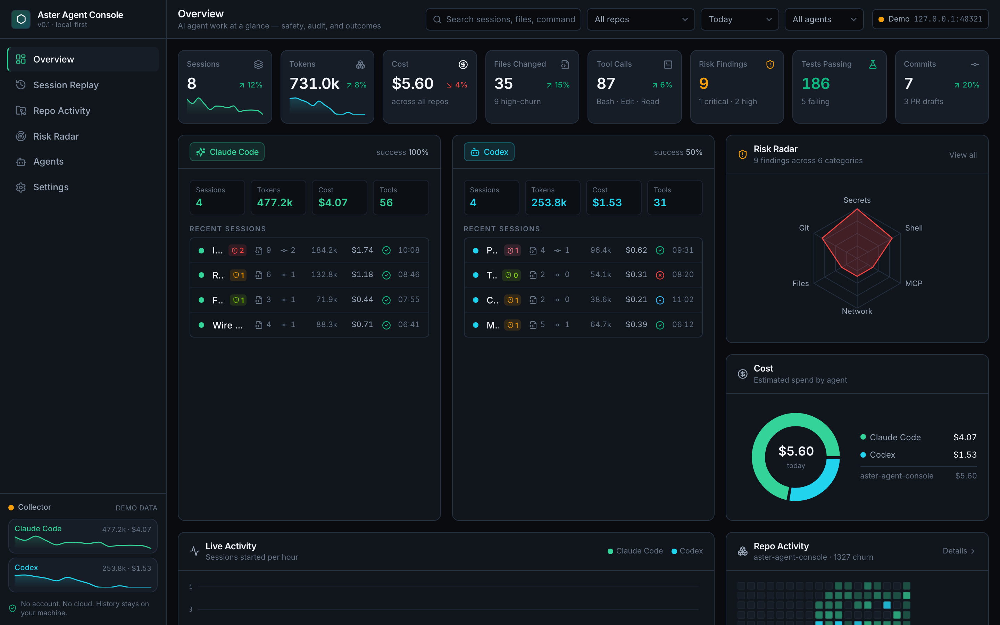
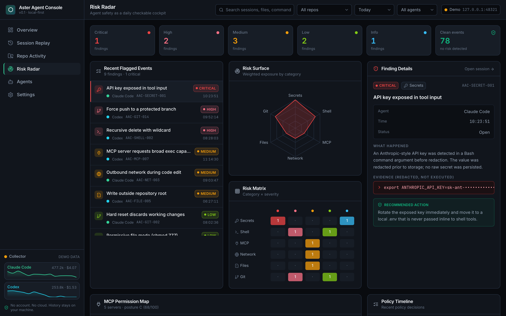
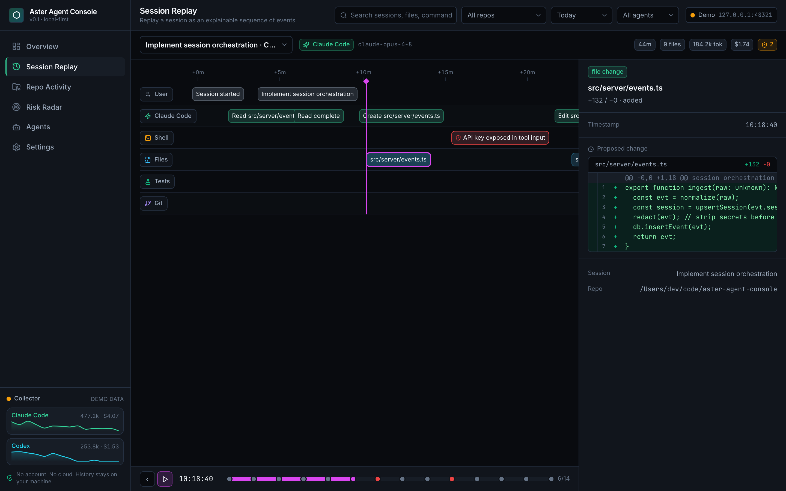
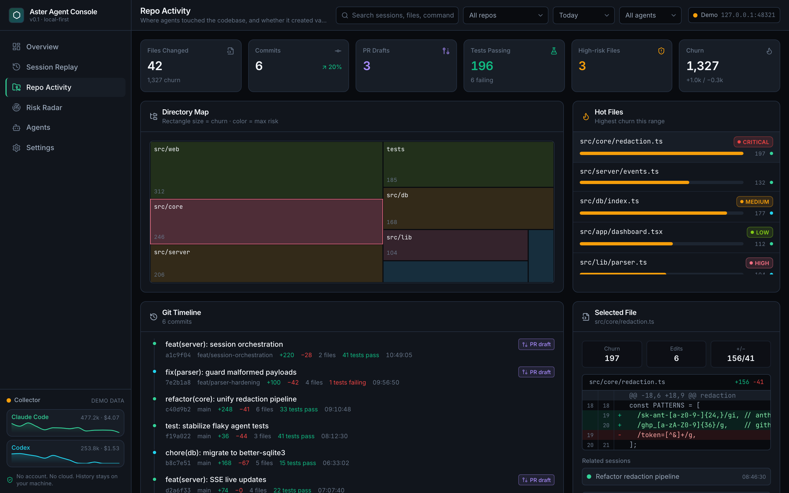
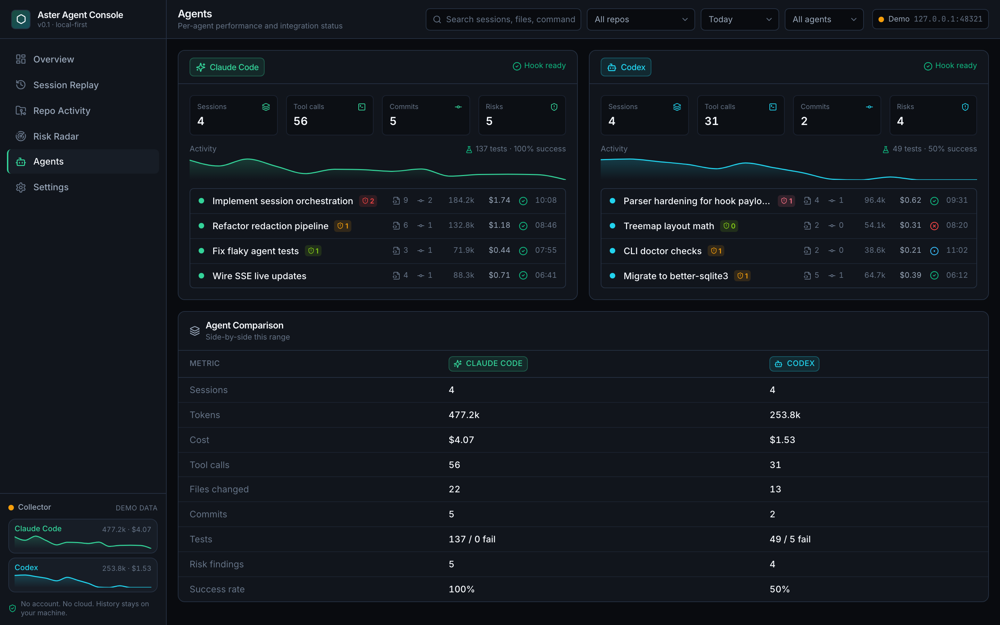
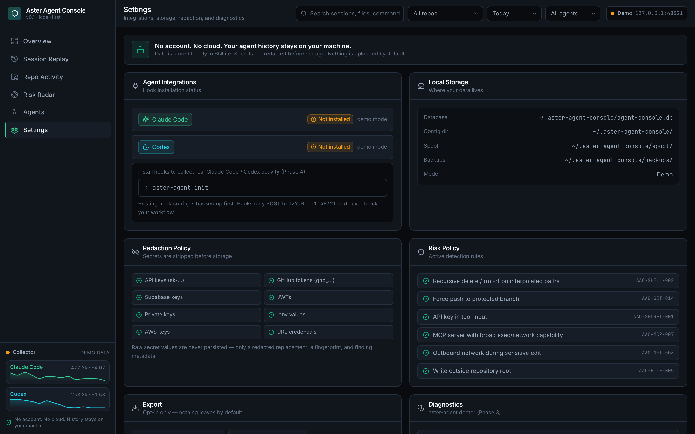

# Aster Agent Console

> Local-first AI coding agent **safety, work audit, and outcome** dashboard for Claude Code and Codex.


Aster Agent Console makes the work of AI coding agents visible along three axes:

1. **Safety** — dangerous shell commands, secret exposure, MCP permission risk, network/file/git operations.
2. **Work Audit** — an explainable timeline from user prompt → tool call → file diff → tests → commit.
3. **Outcome** — sessions, files changed, tests, commits, PR readiness, and cost per useful work.

It is **not** a generic token/cost analytics dashboard. It is an AsterGuard-flavored agent safety & work-audit console.

## Install

Requires Node.js ≥ 20.

```bash
npm install -g @asterworks/agent-console   # then use the `aster-agent` command
# or run without installing:
npx @asterworks/agent-console dashboard
```

New here? The **[5-minute quickstart](docs/quickstart.md)** takes you from install to real data.

## Trust by default

> **No account. No cloud. Your agent history stays on your machine.**

- No external upload by default. Cloud sync stays opt-in, always.
- Secrets are **redacted before storage** — known secret patterns are stripped
  before anything is written to disk (best-effort, pattern-based defense in
  depth; see [privacy](docs/privacy.md)).
- Hook config changes are always backed up first, and fully reversible.
- The local server binds to `127.0.0.1` only and never executes what it collects.

## Status

| Phase | Scope | State |
|------|-------|-------|
| 1 | Local dashboard MVP (Vite + React, deterministic demo data) | ✅ Done |
| 2 | Local collector + SQLite (`POST /events`, redaction, risk, SSE) | ✅ Done |
| 3 | CLI (`aster-agent dashboard / doctor / init`) | ✅ Done |
| 4 | Claude Code + Codex hook integration (install + spool) | ✅ Done |
| 5 | Git & test enrichment (real file diffs, commit association, test results) | ✅ Done |
| 6 | AsterGuard integration — MCP config scan, `AAC-MCP-*` rules, policy config, posture grade | ✅ Done |
| 7 | Public beta — docs, license, feedback templates, npm publish | 🚧 In progress |

76 unit/integration tests pass (`pnpm test`); web + CLI typecheck clean. Phase 5
git execution code was hardened via an adversarial multi-agent review (11 findings
fixed), and the Phase 7 docs were fact-checked against the source by an adversarial
multi-agent pass (21 corrections applied).

## Documentation

- **[Quickstart](docs/quickstart.md)** — install to real data in 5 minutes.
- **[Privacy & data handling](docs/privacy.md)** — what's stored, where, redaction, how to delete it.
- **[MCP security scan](docs/mcp-security.md)** — the `AAC-MCP-*` rules, posture grade, and `policy.json`.
- **[Known limitations](docs/limitations.md)** — what this beta does and does not do.
- **[Troubleshooting](docs/troubleshooting.md)** — common issues and fixes.
- **[Contributing](CONTRIBUTING.md)** · **[Changelog](CHANGELOG.md)**

## CLI

```bash
aster-agent dashboard            # start the collector, serve the UI, open the browser
aster-agent init                 # detect Claude Code / Codex (no agent files touched)
aster-agent init --dry-run       # detect only — modifies nothing
aster-agent init --install-hooks # install collector hooks (backs up existing config first)
aster-agent scan [dir]           # scan local MCP config for security risks (read-only)
aster-agent doctor               # check Node, storage, collector health, hooks, MCP posture
aster-agent hooks status         # show whether hooks are installed
aster-agent hooks uninstall      # back up, then remove only what was installed (restores prior config)
```

### MCP security scan

`aster-agent scan` discovers your MCP config files (Claude `~/.claude.json` &
`.mcp.json`, Cursor, VS Code, Windsurf, Cline, Gemini — **JSON only; Codex's TOML
config is not scanned**) and inspects them read-only — nothing is executed. The
`AAC-MCP-*` rules mirror [AsterGuard](https://github.com/Aster-Works/aster-guard)'s
`AG-*` detections (arbitrary exec, pipe-to-shell installs, runtime env injection,
hardcoded secrets, unverified remote origins, package typosquatting, sensitive-file
access, privilege escalation, credential exfiltration) and share its A–F posture
grade. The findings feed the Risk Radar's MCP panel when the dashboard is live.

Trust without fearmongering is a policy (`~/.aster-agent-console/policy.json`):

```json
{
  "allowedMcpHosts": ["*.mycompany.dev"],
  "ignoreRules": ["AAC-MCP-005"],
  "failOn": "high"
}
```

`allowedMcpHosts` silences the remote-origin finding for hosts you've vetted
(`*.domain` matches subdomains and the apex), `ignoreRules` suppresses rule ids
everywhere, and `failOn` sets the severity at which `scan` exits non-zero (for CI
/ pre-flight gating; `"never"` disables it). See [docs/mcp-security.md](docs/mcp-security.md)
for the full rule table.

The collector binds to `127.0.0.1:48321` only. Hooks read the agent event from
stdin and POST `{ agent, payload }` to the collector, which **redacts secrets
before anything is stored**. If the collector is offline, a **redacted, minimal**
event is spooled to `~/.aster-agent-console/spool/` and replayed on the next
`aster-agent dashboard`. Hooks never execute commands and never block the agent
(short timeout, always exit 0).

## Screens

- **Overview** — KPI strip, Claude Code vs Codex comparison, risk radar, cost, live activity, repo heatmap.
- **Session Replay** — multi-track timeline (User / Agent / Shell / Files / Tests / Git) with a scrubbable playhead and an event inspector (input, redacted output, diff, risk).
- **Repo Activity** — directory treemap, hot files, git timeline, contribution heatmap, file inspector.
- **Risk Radar** — severity counters, risk surface radar, category × severity matrix, finding details, MCP permission map, policy timeline.
- **Agents** / **Settings** — per-agent comparison; integrations, storage, redaction & risk policy, diagnostics.

|  |  |
|---|---|
|  |  |
| **Overview** | **Risk Radar** |
|  |  |
| **Session Replay** | **Repo Activity** |
|  |  |
| **Agents** | **Settings** |

<sub>Screens shown with built-in demo data.</sub>

## Develop

```bash
pnpm install
pnpm dev          # http://127.0.0.1:5173
pnpm test         # 76 unit/integration tests
pnpm typecheck:all
pnpm build:all    # dist/web (dashboard) + dist-cli (CLI bundle)
```

See **[CONTRIBUTING.md](CONTRIBUTING.md)** for setup notes (including the
`corepack` signature-key workaround) and house rules. The dashboard ships with
**deterministic demo data** so every screen works before any hooks are installed
— including a redacted secret finding (`sk-ant-••••`) and dangerous-command
warnings, none of which are ever executed.

## Architecture

```
src/
  core/      shared types (event schema), redaction, risk, normalization, MCP scan + policy
  web/       Vite + React dashboard (app shell, components, routes, demo data)
  db/        SQLite (better-sqlite3) — Phase 2
  server/    local collector + dashboard API + SSE + MCP scan — Phase 2 / 6
  cli/       aster-agent CLI + hook scripts — Phase 3 / 4
```

Local data lives under `~/.aster-agent-console/` (config, `agent-console.db`, `hooks/`, `backups/`, `spool/`, optional `policy.json`).

## Feedback

This is a beta — bug reports and feature ideas are welcome via
[GitHub issues](https://github.com/Aster-Works/aster-agent-console/issues).
Please report security issues privately through a
[security advisory](https://github.com/Aster-Works/aster-agent-console/security/advisories/new)
rather than a public issue.

## License

MIT © Aster Works — see [LICENSE](LICENSE).
